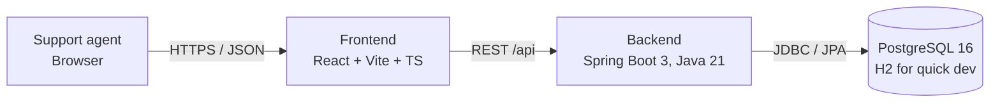
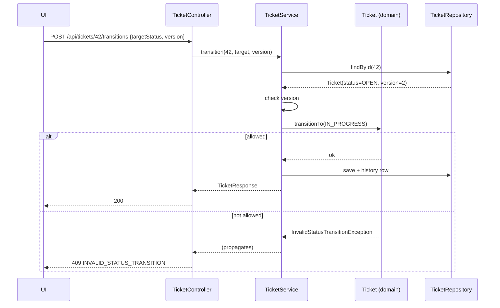

# Architecture

## 1. System context



## 2. Technology choices

| Concern | Choice | Why |
|---------|--------|-----|
| Language / runtime | Java 21 (LTS) | Brief requirement; records, pattern matching |
| Framework | Spring Boot 3.x (Web, Validation, Data JPA, Actuator) | Brief requirement |
| Database | PostgreSQL 16 (default); H2 in `h2` profile | Persistence across restarts; H2 for zero-setup dev |
| Migrations | Flyway | Versioned, reviewable schema changes |
| API docs | springdoc-openapi | Generated contract to compare against `api-contract.md` |
| Build | Maven wrapper (`./mvnw`) | Reproducible builds |
| Backend tests | JUnit 5, AssertJ, Spring Boot Test, MockMvc, Testcontainers | See `test-strategy.md` |
| Frontend | React 18 + Vite + TypeScript, React Router | Simple SPA; Next.js acceptable alternative |
| Frontend data | TanStack Query (or plain `fetch` wrapper) | Caching, loading/error states |
| Frontend tests | Vitest + React Testing Library + MSW; Playwright (optional E2E) | |
| Local infra | Docker Compose (PostgreSQL) | One-command DB |
| AI tooling | Cursor, GitHub Copilot (Kiro optional) | Assessment focus |

## 3. Repository layout

```
syncticket/
├── spec/                          # this folder — source of truth
├── backend/
│   ├── pom.xml
│   └── src/
│       ├── main/java/com/syncticket/
│       │   ├── SyncticketApplication.java
│       │   ├── controller/        # MVC: REST controllers
│       │   ├── service/           # MVC: business logic, @Transactional
│       │   ├── repository/        # MVC: Spring Data JPA + specifications
│       │   ├── model/             # MVC: entities, enums, domain rules on entities
│       │   ├── dto/               # API request/response records
│       │   ├── mapper/            # Entity ↔ DTO mapping
│       │   ├── exception/         # Domain exceptions + GlobalExceptionHandler
│       │   └── config/            # CORS, OpenAPI, etc.
│       ├── main/resources/
│       │   ├── application.yml
│       │   ├── application-h2.yml
│       │   └── db/migration/
│       └── test/java/...          # mirrors main
├── frontend/
│   ├── package.json
│   └── src/
│       ├── api/                   # client.ts, tickets.ts, types.ts, ApiError
│       ├── pages/                 # TicketListPage, TicketCreatePage, TicketDetailPage
│       ├── components/            # TicketForm, StatusBadge, StatusActions, CommentList, ErrorBanner, FieldError
│       └── test/
├── docker-compose.yml
├── .env.example
├── .gitignore
├── .cursor/rules/                 # AI rules for Cursor
├── .github/
│   ├── copilot-instructions.md    # AI rules for Copilot
│   └── workflows/ci.yml
└── README.md
```

Classic **Spring MVC** layering by technical role (not package-by-feature).

## 4. Backend layering (MVC)

```mermaid
flowchart TB
    C[Controller<br/>HTTP, DTO validation] --> S[Service<br/>@Transactional use cases]
    S --> M[Model<br/>entities + Ticket.transitionTo]
    S --> R[Repository<br/>Spring Data JPA]
    R --> DB[(DB)]
    S --> DTO[DTO + Mapper<br/>outbound API shape]
    C -. exceptions .-> E[GlobalExceptionHandler<br/>ProblemDetail]
```

| Layer | Package | Responsibility |
|-------|---------|----------------|
| **View** (API) | `controller`, `dto`, `mapper` | HTTP, JSON shapes, mapping — no JPA in controllers |
| **Controller** | `controller` | Thin REST adapters |
| **Service** | `service` | Use cases, transactions, orchestration |
| **Model** | `model` | JPA entities, enums, invariants (`Ticket`, `TicketStatus`) |
| **Repository** | `repository` | Persistence access |

Rules:
1. Controllers contain no business logic; they validate DTOs (`@Valid`), call a service, return DTOs.
2. Services own transactions (`@Transactional`) and orchestrate; business rules live on the model (`Ticket`, `TicketStatus`).
3. Repositories are only called from services.
4. Entities never leave the service layer; DTOs are Java `record`s.
5. Domain exceptions are translated to HTTP in exactly one place: `GlobalExceptionHandler` (`exception` package).
6. Constructor injection only; no field `@Autowired`.

## 5. Key flows

### 5.1 Status transition



## 6. Configuration & profiles

| Profile | DB | Use |
|---------|----|-----|
| *(default)* | PostgreSQL via env vars | Normal run, restart-persistence demo |
| `h2` | H2 file DB (`./data/tickets`) in PostgreSQL mode | Quick dev without Docker (file mode still survives restart) |
| `test` | Testcontainers PostgreSQL | Integration tests |

`application.yml` (no secrets):

```yaml
spring:
  datasource:
    url: ${DB_URL:jdbc:postgresql://localhost:5432/tickets}
    username: ${DB_USERNAME}
    password: ${DB_PASSWORD}
  jpa:
    hibernate.ddl-auto: validate
    open-in-view: false
  flyway.enabled: true
app:
  cors.allowed-origins: ${CORS_ALLOWED_ORIGINS:http://localhost:5173}
```

## 7. Secrets management (AC-15)

- All credentials come from environment variables; `application*.yml` contains only `${...}` placeholders.
- `.env` (used by Docker Compose) is in `.gitignore`; `.env.example` with dummy values is committed.
- Testcontainers generates throwaway credentials; tests need no secrets.
- CI runs a secret scanner (gitleaks) on every push; a finding fails the build.
- AI tools must not be given real credentials in prompts; `.cursorignore` excludes `.env`.

## 8. AI context management

| File | Content |
|------|---------|
| `.cursor/rules/project.mdc` | Tech stack, layering rules (§4), "specs in `/spec` are source of truth", "do not change the state machine without updating `spec/state-machine.md`", "no secrets", "every change needs tests" |
| `.github/copilot-instructions.md` | Same rules condensed for Copilot |
| `.cursorignore` | `.env`, `data/`, `node_modules/`, `target/`, build output |

Working practice:
- One feature per AI session; attach only the relevant spec files and the target package.
- Ask the AI to produce a plan and test list first, review it, then generate code.
- Commit in small, reviewed steps; commit messages reference requirement IDs (e.g. `feat(FR-09): add transition endpoint`).

## 9. Observability

- Spring Boot Actuator `/actuator/health` (exposed), others off by default.
- Structured logs; log a WARN for rejected transitions with ticket id, from, to.
- Never log request bodies containing free text at INFO level.
