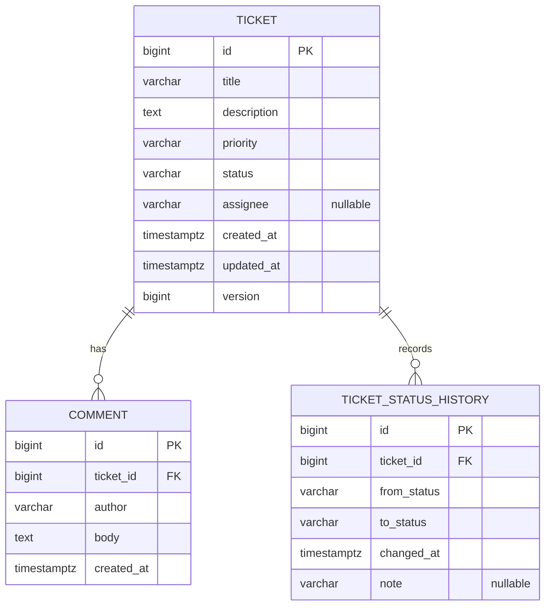

# Data Model

## 1. Entity relationship diagram



## 2. Enums

| Enum | Values | Storage |
|------|--------|---------|
| `TicketStatus` | `OPEN`, `IN_PROGRESS`, `RESOLVED`, `CLOSED`, `CANCELLED` | `VARCHAR(20)` + `CHECK` constraint, mapped with `@Enumerated(EnumType.STRING)` |
| `TicketPriority` | `LOW`, `MEDIUM`, `HIGH`, `CRITICAL` | `VARCHAR(20)` + `CHECK` constraint, `EnumType.STRING` |

Never use `EnumType.ORDINAL` — reordering the enum would silently corrupt data.

## 3. Tables

### 3.1 `ticket`

| Column | Type | Null | Default | Notes |
|--------|------|------|---------|-------|
| `id` | `BIGINT` identity | no | generated | PK |
| `title` | `VARCHAR(200)` | no | | 3–200 chars (validated in app) |
| `description` | `VARCHAR(5000)` | no | | |
| `priority` | `VARCHAR(20)` | no | | CHECK in priority enum |
| `status` | `VARCHAR(20)` | no | `'OPEN'` | CHECK in status enum |
| `assignee` | `VARCHAR(100)` | yes | `NULL` | NULL = unassigned |
| `created_at` | `TIMESTAMP WITH TIME ZONE` | no | now | set once |
| `updated_at` | `TIMESTAMP WITH TIME ZONE` | no | now | updated on every change |
| `version` | `BIGINT` | no | `0` | JPA `@Version` for optimistic locking |

Indexes:
- `idx_ticket_status` on `(status)` — status filter
- `idx_ticket_created_at` on `(created_at DESC)` — default sort
- (Optional, PostgreSQL only) `pg_trgm` GIN indexes on `lower(title)`, `lower(description)` if search becomes slow.

### 3.2 `comment`

| Column | Type | Null | Notes |
|--------|------|------|-------|
| `id` | `BIGINT` identity | no | PK |
| `ticket_id` | `BIGINT` | no | FK → `ticket(id)` |
| `author` | `VARCHAR(100)` | no | |
| `body` | `VARCHAR(2000)` | no | |
| `created_at` | `TIMESTAMP WITH TIME ZONE` | no | |

Index: `idx_comment_ticket_id` on `(ticket_id, created_at)`.

### 3.3 `ticket_status_history`

| Column | Type | Null | Notes |
|--------|------|------|-------|
| `id` | `BIGINT` identity | no | PK |
| `ticket_id` | `BIGINT` | no | FK → `ticket(id)` |
| `from_status` | `VARCHAR(20)` | yes | NULL for the initial `OPEN` on creation |
| `to_status` | `VARCHAR(20)` | no | |
| `changed_at` | `TIMESTAMP WITH TIME ZONE` | no | |
| `note` | `VARCHAR(2000)` | yes | Resolution note when `to_status` is `RESOLVED` or `CANCELLED`; NULL otherwise (including initial `OPEN` on create) |

## 4. JPA mapping rules

- `Ticket` → `@OneToMany(mappedBy = "ticket")` comments, **LAZY**. The list endpoint MUST NOT load comments (avoid N+1); it returns `commentCount` via a count query or projection.
- `Comment` → `@ManyToOne(fetch = LAZY)` ticket.
- Entities are never returned from controllers; map to DTOs (`TicketResponse`, `TicketSummaryResponse`, `CommentResponse`).
- `createdAt`/`updatedAt` set via `@PrePersist`/`@PreUpdate` or Spring Data auditing, using `Instant` (UTC).
- `status` has no public setter; it changes only via `Ticket.transitionTo(...)`.

## 5. Migrations (Flyway)

Location: `backend/src/main/resources/db/migration/`

| File | Content |
|------|---------|
| `V1__create_ticket.sql` | `ticket` table, CHECK constraints, indexes |
| `V2__create_comment.sql` | `comment` table, FK, index |
| `V3__create_ticket_status_history.sql` | history table, FK, `note` column |
| `dev/V4__seed_hundred_tickets.sql` *(dev profile only, via `spring.flyway.locations`)* | 100 seed tickets (varied status/priority), history rows, sample comments; idempotent |

Rules:
- Migrations are immutable once merged; fix forward with a new version.
- SQL must run on both PostgreSQL and H2 (in PostgreSQL mode), or use vendor-specific folders `db/migration/{vendor}`.
- `spring.jpa.hibernate.ddl-auto=validate`.

## 6. Search query

```sql
SELECT ... FROM ticket
WHERE (:status IS NULL OR status = :status)
  AND (:q IS NULL
       OR LOWER(title)       LIKE LOWER(CONCAT('%', :q, '%'))
       OR LOWER(description) LIKE LOWER(CONCAT('%', :q, '%')))
ORDER BY created_at DESC
```

- Implement with Spring Data `Specification` or a `@Query` with named parameters. **Never** build SQL by string concatenation of user input.
- Escape `%` and `_` in `q` so they are matched literally.
