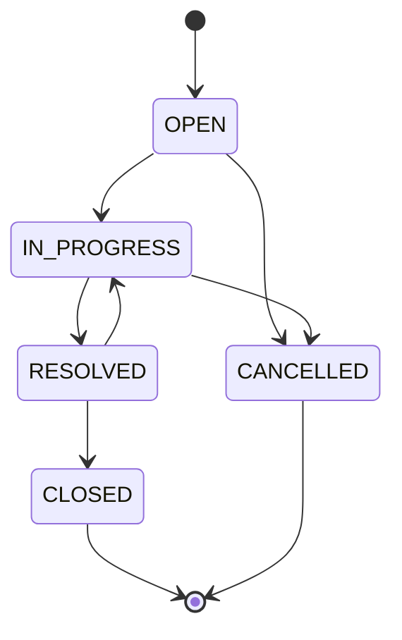

# Ticket State Machine

The backend is the **only** authority on status transitions. The frontend may hide invalid actions for usability, but must never be relied on for enforcement.

## 1. States

| Status | Meaning | Terminal |
|--------|---------|----------|
| `OPEN` | Created, not yet being worked on | No |
| `IN_PROGRESS` | An agent is actively working on it | No |
| `RESOLVED` | Fix/answer delivered, awaiting closure | No |
| `CLOSED` | Done; no further changes | **Yes** |
| `CANCELLED` | Abandoned or invalid; no further changes | **Yes** |

Initial state for every new ticket: `OPEN`.

## 2. Diagram



## 3. Transition table (allowed)

| # | From | To |
|---|------|----|
| T1 | `OPEN` | `IN_PROGRESS` |
| T2 | `IN_PROGRESS` | `RESOLVED` |
| T3 | `RESOLVED` | `CLOSED` |
| T4 | `OPEN` | `CANCELLED` |
| T5 | `IN_PROGRESS` | `CANCELLED` |
| T6 | `RESOLVED` | `IN_PROGRESS` (reopen) |

**Everything else is invalid.**

Transitions to `RESOLVED` or `CANCELLED` require a resolution `note` on the API (see `requirements.md` BR-06, FR-13). The note is persisted on the `ticket_status_history` row for that transition.

## 4. Full transition matrix

Rows = current status, columns = target status. ✅ allowed, ❌ rejected.

| From \ To | OPEN | IN_PROGRESS | RESOLVED | CLOSED | CANCELLED |
|-----------|:----:|:-----------:|:--------:|:------:|:---------:|
| **OPEN** | ❌ | ✅ | ❌ | ❌ | ✅ |
| **IN_PROGRESS** | ❌ | ❌ | ✅ | ❌ | ✅ |
| **RESOLVED** | ❌ | ✅ | ❌ | ✅ | ❌ |
| **CLOSED** | ❌ | ❌ | ❌ | ❌ | ❌ |
| **CANCELLED** | ❌ | ❌ | ❌ | ❌ | ❌ |

25 combinations: **6 valid, 19 invalid.** The integration test suite MUST cover all 25 (see `test-strategy.md §4`).

Notable invalid examples from the brief: `CLOSED → OPEN`, `RESOLVED → OPEN`, `CANCELLED → OPEN`. Also invalid: skipping steps (`OPEN → RESOLVED`, `OPEN → CLOSED`), going backwards (`IN_PROGRESS → OPEN`), and self-transitions (`OPEN → OPEN`).

## 5. Implementation rules

1. The transition table lives in **one place**: the `TicketStatus` enum (or a dedicated `TicketStateMachine` class). No `if/else` status checks scattered across services or controllers.

   ```java
   public enum TicketStatus {
       OPEN, IN_PROGRESS, RESOLVED, CLOSED, CANCELLED;

       private static final Map<TicketStatus, Set<TicketStatus>> ALLOWED = Map.of(
           OPEN,        EnumSet.of(IN_PROGRESS, CANCELLED),
           IN_PROGRESS, EnumSet.of(RESOLVED, CANCELLED),
           RESOLVED,    EnumSet.of(CLOSED, IN_PROGRESS),
           CLOSED,      EnumSet.noneOf(TicketStatus.class),
           CANCELLED,   EnumSet.noneOf(TicketStatus.class)
       );

       public boolean canTransitionTo(TicketStatus target) {
           return ALLOWED.get(this).contains(target);
       }

       public Set<TicketStatus> allowedTransitions() {
           return Collections.unmodifiableSet(ALLOWED.get(this));
       }

       public boolean isTerminal() {
           return ALLOWED.get(this).isEmpty();
       }
   }
   ```

2. The domain method `Ticket.transitionTo(target)` checks `canTransitionTo` and throws `InvalidStatusTransitionException(from, to)` if not allowed. The service never sets `status` directly.
3. The transition is executed inside a transaction with optimistic locking (`@Version`), so two concurrent transitions cannot both succeed from the same starting state.
4. A successful transition writes a `ticket_status_history` row (FR-11) and updates `updatedAt`.
5. `status` MUST NOT be accepted by the create or general update endpoints (BR-03). Unknown/extra fields in those payloads are ignored or rejected, never applied.

## 6. API behaviour

| Situation | HTTP | Error code |
|-----------|------|-----------|
| Valid transition | `200 OK` | — (returns updated ticket) |
| Transition not in table | `409 Conflict` | `INVALID_STATUS_TRANSITION` |
| Unknown target status value (e.g. `"DONE"`) | `400 Bad Request` | `VALIDATION_FAILED` |
| Missing target status | `400 Bad Request` | `VALIDATION_FAILED` |
| Missing/blank `note` when target is `RESOLVED` or `CANCELLED` | `400 Bad Request` | `VALIDATION_FAILED` (`errors[].field` = `note`) |
| Ticket not found | `404 Not Found` | `TICKET_NOT_FOUND` |
| Stale version (concurrent edit) | `409 Conflict` | `CONCURRENT_MODIFICATION` |

Error message for invalid transitions MUST name both states, e.g. *"Cannot change status from CLOSED to OPEN."* and include `currentStatus` and `allowedTransitions` in the error body (see `api-contract.md`).

## 7. Interaction with other operations

| Operation | OPEN | IN_PROGRESS | RESOLVED | CLOSED | CANCELLED |
|-----------|:----:|:-----------:|:--------:|:------:|:---------:|
| Update fields / assignee | ✅ | ✅ | ✅ | ❌ `409 TICKET_NOT_EDITABLE` | ❌ `409 TICKET_NOT_EDITABLE` |
| Add comment | ✅ | ✅ | ✅ | ❌ `409 TICKET_NOT_EDITABLE` | ❌ `409 TICKET_NOT_EDITABLE` |
| Edit / delete comment | ✅ | ✅ | ✅ | ❌ `409 TICKET_NOT_EDITABLE` | ❌ `409 TICKET_NOT_EDITABLE` |

(Based on assumptions A-03 and BR-07 in `requirements.md`.)
