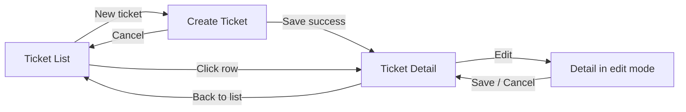

# UI Flow

## 1. Screens & routes

| Route | Screen | Requirements |
|-------|--------|--------------|
| `/` → redirect `/tickets` | — | |
| `/tickets` | Ticket List | FR-02, FR-07, FR-08 |
| `/tickets/new` | Create Ticket | FR-01 |
| `/tickets/:id` | Ticket Detail (view, edit, status, comments) | FR-03 – FR-06, FR-09, FR-10 |
| `*` | Not Found | |

## 2. Navigation



The list's search text, status filter and page are kept in the URL query string (`/tickets?q=login&status=OPEN&page=1`) so Back and refresh preserve them.

## 3. Screen specifications

### 3.1 Ticket List

```
┌───────────────────────────────────────────────────────────────┐
│ Support Tickets                               [+ New ticket]  │
│ [🔍 Search title or description...]  [Status: All ▾]          │
├──────┬──────────────────────┬──────────┬────────────┬─────────┤
│ #    │ Title                │ Priority │ Status     │ Assignee│
├──────┼──────────────────────┼──────────┼────────────┼─────────┤
│ 42   │ Cannot log in        │ HIGH     │ IN_PROGRESS│ Priya   │
│ ...                                                           │
├───────────────────────────────────────────────────────────────┤
│                          ‹ Prev  Page 1 of 3  Next ›          │
└───────────────────────────────────────────────────────────────┘
```

- Search input is debounced (300 ms) and resets page to 0.
- Status dropdown: `All` + the five statuses; resets page to 0.
- States: **loading** (skeleton rows), **empty** ("No tickets match your search." + clear-filters link), **error** (ErrorBanner with Retry).
- Status shown as a coloured badge; priority as text/badge.
- Unassigned shown as "Unassigned" in muted text.

### 3.2 Create Ticket

Fields: Title*, Description* (textarea), Priority* (select, default `MEDIUM`), Assignee (text, optional).

- Client-side validation mirrors backend rules for fast feedback, **but the backend is authoritative**; server field errors are always displayed.
- Submit button disabled while submitting; shows spinner.
- On `201`: navigate to `/tickets/{id}` and show toast "Ticket #42 created".
- On `400`: map `errors[].field` to the matching inputs, focus the first invalid field.

### 3.3 Ticket Detail

```
┌───────────────────────────────────────────────────────────────┐
│ ← Back to tickets                                             │
│ #42  Cannot log in to portal              [IN_PROGRESS]       │
│ Priority: HIGH   Assignee: Priya   Created: 25 Sep 10:15      │
│                                                    [Edit]     │
│ Description ...                                               │
├───────────────────────────────────────────────────────────────┤
│ Status actions:  [Mark resolved]  [Cancel ticket]             │
├───────────────────────────────────────────────────────────────┤
│ Status history                                                │
│  — OPEN · 25 Sep 10:15                                        │
│  OPEN → IN_PROGRESS · 25 Sep 11:00                            │
│  ... (oldest first, from GET /api/tickets/{id}/history)       │
├───────────────────────────────────────────────────────────────┤
│ Comments (3)                                                  │
│  Rahul · 25 Sep 10:20  — Reproduced on staging.               │
│  ...                                                          │
│ Your name [________]                                          │
│ [Write a comment...                              ] [Add]      │
└───────────────────────────────────────────────────────────────┘
```

**Edit mode**: title, description, priority, assignee become inputs; Save sends `PATCH` with only changed fields + `version`. Assignee can be cleared ("Unassign").

**Status actions** are rendered from `allowedTransitions` in the API response (FR-10) — never hard-coded:

| Target | Button label | Confirmation / extra UI |
|--------|-------------|-------------------------|
| `IN_PROGRESS` (from `OPEN`) | Start progress | no |
| `IN_PROGRESS` (from `RESOLVED`) | Reopen | no |
| `RESOLVED` | Mark resolved | **Resolution note required** (textarea, same rules as §6); submit transition with `note` |
| `CLOSED` | Close ticket | yes (confirm dialog only; no note) |
| `CANCELLED` | Cancel ticket | yes ("This cannot be undone.") + **resolution note required** before submit |

Terminal tickets (`CLOSED`, `CANCELLED`): no status buttons, Edit button hidden, comment form and per-comment Edit/Delete hidden; message: "This ticket is closed and can no longer be changed."

**Status history**: section below status actions, above comments; load `GET /api/tickets/{id}/history`; list `fromStatus → toStatus` (or "— → OPEN" for creation) with locale date/time; show `note` on the row when present (muted text under the transition); oldest first.

**Comments**: newest at the bottom; each row has **Edit** and **Delete** when the ticket is editable. Edit inline or small modal: `PATCH` body only. Delete: confirm then `DELETE`. After add/edit, refresh or merge from response. After posting new comment, clear body (keep author name in session).

## 4. API client

- One `apiClient` wrapper around `fetch`: sets JSON headers, parses Problem Details on non-2xx and throws a typed `ApiError { status, code, detail, fieldErrors }`.
- Network failure (no response) throws `ApiError` with `code = "NETWORK_ERROR"`.
- Base URL from `VITE_API_BASE_URL` (default `/api` with a Vite dev proxy to `localhost:8080`).

## 5. Error display (AC-13)

| Error | Where shown | Message shown to user |
|-------|-------------|-----------------------|
| `VALIDATION_FAILED` with `errors[]` | Under each field (red text, `aria-describedby`) | server `message` per field |
| `VALIDATION_FAILED` without field | ErrorBanner at top of form | server `detail` |
| `TICKET_NOT_FOUND` | Full-page "Ticket not found" with link back to list | "Ticket #{id} does not exist." |
| `INVALID_STATUS_TRANSITION` | ErrorBanner above status actions; refetch ticket | server `detail` (e.g. "Cannot change status from CLOSED to OPEN.") |
| `TICKET_NOT_EDITABLE` | ErrorBanner; refetch ticket | server `detail` |
| `CONCURRENT_MODIFICATION` | ErrorBanner with **Reload** button | "This ticket was changed by someone else. Reload to see the latest version." |
| `INTERNAL_ERROR` | ErrorBanner / toast | "Something went wrong on our side. Please try again." |
| `NETWORK_ERROR` | ErrorBanner with Retry | "Cannot reach the server. Check your connection and try again." |

Rules:
- Never show raw JSON, stack traces or HTTP status codes alone.
- Errors clear when the user edits the offending field or retries.
- Error banners use `role="alert"` for screen readers.
- User input is preserved when a save fails.

## 6. Accessibility & UX basics

- All inputs have labels; buttons are keyboard reachable; visible focus.
- Status colour is always paired with text (not colour alone).
- Dates shown in the browser's locale/time zone.
